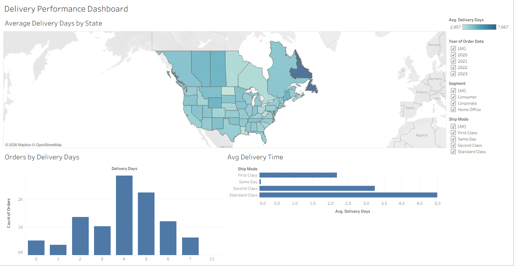

# 📦 Delivery Performance Dashboard

## 📌 Project Overview

This project analyzes delivery performance using the Tableau Superstore dataset. The dashboard helps identify delivery trends across states, shipping modes, and customer segments through interactive visualizations.

---

## 🎯 Business Objective

The dashboard was created to answer the following business questions:

- Which states have the highest average delivery time?
- Which shipping mode delivers orders the fastest?
- How are delivery days distributed across all orders?
- How do delivery times change by year and customer segment?

---

## 🖼️ Dashboard Preview

---

## 📊 Dashboard Features

- Interactive map showing average delivery days by state
- Distribution of delivery days across all orders
- Average delivery time by shipping mode
- Dynamic filters:
  - Order Year
  - Customer Segment
  - Ship Mode

---

## 📈 Key Insights

- Standard Class has the highest average delivery time.
- Same Day shipping is the fastest delivery option.
- Delivery performance varies significantly between states.
- Interactive filters allow detailed analysis by year, segment, and shipping mode.

---

## 🛠️ Tools Used

- Tableau Public
- Tableau Desktop
- Superstore Dataset

---

## 📂 Dataset

Sample Superstore Dataset

---

## 📁 Repository Contents

- `delivery-performance-dashboard.twbx` – Tableau workbook
- `dashboard.png` – Dashboard preview
- `README.md` – Project documentation

---

## 👤 Author

**Zeynep Tatlısöz**  
Aspiring Data Analyst
